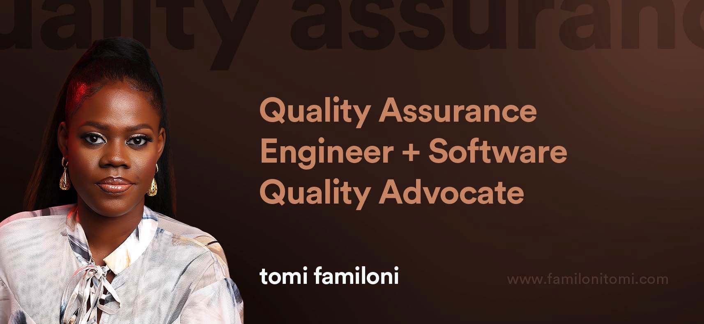

Hi there. Thank you for dropping by!

I am **Tomi Familoni**. I currently work as a QA Automation Engineer at [AZA Finance](http://azafinance.com/); a financial tech organisation that serves as a market maker in African currencies by providing hybrid infrastructure for companies to use African currencies with less risk, cost, and friction. 
At AZA, I work with Software Engineers and Product Managers to deliver quality financial solutions.

In my free time, I write articles about software testing and software quality. Feel free to check these articles here: [familonitomi.com](https://familonitomi.com/)

## :notebook: Latest blog posts
<!-- BLOG-POST-LIST:START -->
- [Getting Started with Test Automation Code Reviews](https://familonitomi.com/2021/11/getting-started-with-test-automation-code-reviews/)
- [How to Make Remote Pair Testing Work](https://familonitomi.com/2021/03/how-to-make-remote-pair-testing-work/)
- [Four Unconventional Ways of Improving Software Quality](https://familonitomi.com/2021/06/four-unconventional-ways-of-improving-software-quality/)
- [Preparing for ISTQB Advanced Level – Test Manager Certification Examination](https://familonitomi.com/2020/03/preparing-for-istqb-advanced-level-test-manager-certification-examination/)
- [Talk: Getting started with Bug reporting](https://familonitomi.com/2021/12/talk-becoming-a-global-qa-engineer/)
- [Talk: Becoming a global QA Engineer](https://familonitomi.com/2021/12/talk-getting-started-with-bug-reporting/)
<!-- BLOG-POST-LIST:END -->
